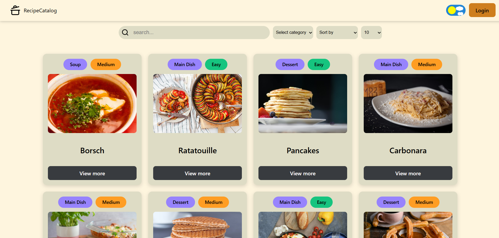
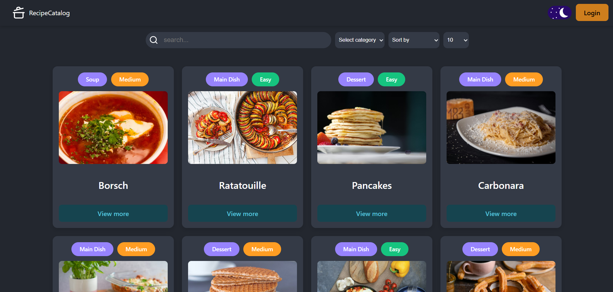

## Recipes Catalog — Global Recipe Hub

### 🌟 Project Overview

ReactCards is a modern web application designed to serve as a centralized directory for culinary recipes from around the world. Instead of hosting full cooking instructions, the project acts as an aggregator where users can store essential information about various dishes (origin, calories, cook time) and keep direct links to the original full recipes. It’s a perfect tool for organizing a personal collection of favorite international meals in one place.

### 🏞️ Project Previews

<p align="center">
   
   
</p>

🔗 [Live Demo](https://recipe-catalog-2edg.vercel.app/)

### 🚀 Key Features & Functionality

- Centralized Recipe Management: Store key metadata (country of origin, difficulty, time) and external links to full instructions.

- Search & Filter Sync: Advanced filtering by categories (Main dish, Soup, Dessert, Snack ) and sorting logic, all synchronized with URL searchParams.

- Robust Form Validation: Powered by Zod and React Hook Form, ensuring data integrity (e.g., preventing negative values, validating image URLs).

- Dynamic Theme Switching: Integrated Light and Dark modes with a custom soft-color palette for better readability.

- Real-time Notifications: Success and error feedback using React-Toastify.

- CRUD Operations: Fully functional Create, Read, Detele and Update operations integrated with a remote API.

### 🛠 Technologies Used

- Core: React 19, TypeScript, Vite

- Routing: React Router 7

- Backend Integration: MockAPI.io (RESTful API).

- Form Management: React Hook Form, Zod (Validation Schema)

- UI Components: React Icons (Lucide, Font Awesome), React-Toastify.

- Development Tools: ESLint, Prettier

- Automation: Generate React CLI

- Styling: CSS Modules

## Folder Structure

```text
src/
├── assets/              # Static assets (images, icons, etc.)
├── auth/                # Authentication logic
│ └── AuthProvider/      # Auth context and provider components
├── components/          # Reusable UI components
│ ├── Badge/
│ ├── Button/
│ ├── Header/
│ ├── Loader/
│ ├── MainLayout/
│ ├── RecipeCard/
│ ├── RecipeCardList/
│ ├── RecipeForm/
│ ├── SearchInput/
│ └── icons.tsx          # Shared icon components/library
├── constants/           # App-wide constants
│ └── global.constants.ts
├── features/            # Complex functional modules
│ └── ThemeToggler/      # Theme switching logic & UI
├── helpers/             # Utility functions
│ ├── dateFormat.ts
│ └── delayFn.ts
├── hooks/               # Custom React hooks
│ ├── useAuth.ts
│ ├── useFetch.ts
│ └── useTheme.ts
├── pages/               # Routed view components
│ ├── AddRecipePage/
│ ├── EditRecipePage/
│ ├── ForbiddenPage/
│ ├── HomePage/
│ ├── NotFoundPage/
│ └── RecipePage/
├── theme/               # Styling configuration & provider
│ ├── index.ts
│ └── ThemeProvider.tsx
├── types/               # Global TypeScript definitions
│ ├── global.enums.ts
│ └── global.types.ts
├── App.tsx              # Main application shell & routing
├── index.css            # Global styles
└── main.tsx             # Application entry point
```

### How to run a project locally

Open a terminal and run the command:

#### 1. Clone the repository:

```bash
git clone [https://github.com/AlexandraKurylo/recipe-catalog](https://github.com/AlexandraKurylo/recipe-catalog)
```

#### 2. Install dependencies:

```bash
   npm install
```

#### 3. Configure API (Optional):

Ensure the API URL in src/constants/global.constants.ts points to your MockAPI endpoint.

#### 4. Start the development server:

```bash
   npm run dev
```

#### 5. Open in browser:

The app will be running at http://localhost:5173
